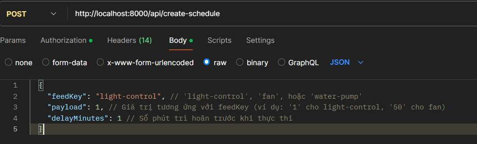

# BE docs

## BaseURLs

`http://localhost:8000/api`

`https://dadn-2.onrender.com/api`

`https://dadn-yolohome.onrender.com/api`

## Endpoints

### 1. Đăng Ký Người Dùng

- **URL:** `/register`
- **Phương thức:** `POST`
- **Mô tả:** Đăng ký người dùng mới.
- **Nội dung yêu cầu:**
  ```json
  {
    "username": "string",
    "password": "string"
  }
  ```
- **Phản hồi:**
  - `200 OK`: Đăng ký người dùng thành công.
  - `409 Conflict`: Tên người dùng đã tồn tại.
  - `400 Bad Request`: Thiếu tên người dùng hoặc mật khẩu.
  - `500 Internal Server Error`: Lỗi server.
- Khi đăng nhập thành công, sẽ có một token trả về. Mọi người lưu token này để đính kèm vào header của request khi fetch API.

### 2. Đăng Nhập Người Dùng

- **URL:** `/login`
- **Phương thức:** `POST`
- **Mô tả:** Đăng nhập.
- **Nội dung yêu cầu:**
  ```json
  {
    "username": "string",
    "password": "string"
  }
  ```
- **Phản hồi:**
  - `200 OK`: Đăng nhập thành công.
  - `401 Unauthorized`: Mật khẩu không chính xác.
  - `409 Conflict`: Không tìm thấy tên người dùng.
  - `400 Bad Request`: Thiếu tên người dùng hoặc mật khẩu.
  - `500 Internal Server Error`: Lỗi server.

### 3. Đổi mật khẩu

- **URL:** `/changePassword`
- **Phương thức:** `POST`
- **Mô tả:** Đổi mật khẩu ứng với username gửi về.
- **Nội dung yêu cầu:**
  ```json
  {
    "username": "string",
    "password": "string",
    "newpassword": "string"
  }
  ```

**_Yêu cầu token ở header của request._**

- **Phản hồi:**
  - `200 OK`: Đổi mật khẩu thành công.
  - `401 Unauthorized`: Mật khẩu không chính xác.
  - `409 Conflict`: Không tìm thấy tên người dùng.
  - `400 Bad Request`: Thiếu tên người dùng hoặc mật khẩu.
  - `500 Internal Server Error`: Lỗi server.

### 4. Lấy Dữ Liệu Nhiệt Độ Từ Adafruit

- **URL:** `/adafruit/thermal`
- **Phương thức:** `GET`
- **Mô tả:** Lấy dữ liệu nhiệt độ từ Adafruit.
- **Phản hồi:**
  - `200 OK`: Trả về dữ liệu nhiệt độ.
  - `500 Internal Server Error`: Lỗi server.

**_Yêu cầu token ở header của request._**

### 5. Lấy Dữ Liệu Đèn Từ Adafruit

- **URL:** `/adafruit/light`
- **Phương thức:** `GET`
- **Mô tả:** Lấy dữ liệu đèn từ Adafruit.
- **Phản hồi:**
  - `200 OK`: Trả về dữ liệu đèn.
  - `500 Internal Server Error`: Lỗi server.

**_Yêu cầu token ở header của request._**

### 6. Lấy Dữ Liệu Độ Ẩm Đất Từ Adafruit

- **URL:** `/adafruit/earth-humid`
- **Phương thức:** `GET`
- **Mô tả:** Lấy dữ liệu độ ẩm đất từ Adafruit.
- **Phản hồi:**
  - `200 OK`: Trả về dữ liệu độ ẩm đất.
  - `500 Internal Server Error`: Lỗi server.

**_Yêu cầu token ở header của request._**

### 7. Lấy Dữ Liệu Độ Ẩm Không Khí Từ Adafruit

- **URL:** `/adafruit/humid`
- **Phương thức:** `GET`
- **Mô tả:** Lấy dữ liệu độ ẩm không khí từ Adafruit.
- **Phản hồi:**
  - `200 OK`: Trả về dữ liệu độ ẩm không khí.
  - `500 Internal Server Error`: Lỗi server.

**_Yêu cầu token ở header của request._**

## Ví dụ fetch data (ReactJS)

Fetch data nhiệt độ:

```javascript
const [adafruitData, setAdafruitData] = useState([]);

const API = `${BaseURL}/adafruit/thermal`

async function fetchAdafruitData() {
  try {
    const response = await fetch(API,
        headers: {
          Authorization: `Bearer ${token}`,
        },
    );
    if (!response.ok) {
      throw new Error(`HTTP error! status: ${response.status}`);
    }
    const data = await response.json();
    setAdafruitData(data);
  } catch (error) {
    console.error('Error fetching Adafruit data:', error);
  }
}

useEffect(() => {
  fetchAdafruitData();
}, []);
```

Hiển thị data:

```jsx
<div className="adafruit-component-content">
  {adafruitData ? (
    <pre>{JSON.stringify(adafruitData, null, 2)}</pre>
  ) : (
    <p>Loading Adafruit data...</p>
  )}
</div>
```

### 8. Điều khiển quạt

- **URL:** `/device/fan`
- **Phương thức:** `POST`
- **Mô tả:** Gửi giá trị điều khiển mới cho quạt.
- **Nội dung yêu cầu:**
  ```json
  {
    "value": "string" // Giá trị từ "0" đến "100"
  }
  ```
- **Phản hồi:**
  - `200 OK` hoặc `201 Created`: Gửi lệnh thành công. Có thể trả về dữ liệu vừa tạo.
    ```json
    { "id": "...", "value": "75", "feed_id": "...", "feed_key": "fan", "..." }
    ```
  - `400 Bad Request`: Giá trị không hợp lệ hoặc thiếu.
  - `500 Internal Server Error`: Lỗi server hoặc lỗi khi gửi lên Adafruit.

**_Yêu cầu token ở header của request._**

### 9. Điều khiển bơm

- **URL:** `/device/water-pump`
- **Phương thức:** `POST`
- **Mô tả:** Gửi giá trị điều khiển mới cho máy bơm.
- **Nội dung yêu cầu:**
  ```json
  {
    "value": "string" // Giá trị từ "0" đến "100"
  }
  ```
- **Phản hồi:** Tương tự mục 8.

**_Yêu cầu token ở header của request._**

### 10. Điều khiển đèn

- **URL:** `/device/light-control`
- **Phương thức:** `POST`
- **Mô tả:** Gửi giá trị điều khiển mới cho đèn (Bật/Tắt).
- **Nội dung yêu cầu:**
  ```json
  {
    "value": "string" // Giá trị là "1" (ON) hoặc "0" (OFF)
  }
  ```
- **Phản hồi:** Tương tự mục 8.

**_Yêu cầu token ở header của request._**

## Ví dụ gửi lệnh điều khiển đèn (ReactJS)

Gửi lệnh bật đèn:

```javascript
const API = `${BaseURL}/device/light-control`;
const token = localStorage.getItem("token");

async function turnLightOn() {
  try {
    const response = await fetch(API, {
      method: "POST",
      headers: {
        "Content-Type": "application/json",
        Authorization: `Bearer ${token}`,
      },
      body: JSON.stringify({ value: "1" }), // Gửi giá trị '1' để bật
    });

    if (!response.ok) {
      const errorBody = await response.text();
      throw new Error(`HTTP error! status: ${response.status} - ${errorBody}`);
    }

    const result = await response.json();
    console.log("Light control success:", result);
  } catch (error) {
    console.error("Error controlling light:", error);
  }
}
```

### 11. Tạo Lịch Trình (Schedule)

- **URL:** `/create-schedule`
- **Phương thức:** `POST`
- **Mô tả:** Tạo một lịch trình mới để thực thi một hành động sau một khoảng thời gian.
- **Nội dung yêu cầu:**
  ```json
  {
    "feedKey": "string",
    "payload": number,
    "delayMinutes": number
  }
  ```
  **_feedkey_**: `light-control`, `fan` hoặc `water-pump`
- **Phản hồi:**
  - `201 Created`: Lịch trình tạo thành công.
    ```json
    {
      "message": "Schedule created successfully",
      "scheduleId": number // ID của lịch trình vừa tạo
    }
    ```
  - `400 Bad Request`: Thiếu trường bắt buộc hoặc `delayMinutes` không hợp lệ.
  - `401 Unauthorized`: Token không hợp lệ hoặc thiếu.
  - `500 Internal Server Error`: Lỗi server khi tạo lịch trình.



**_Yêu cầu token ở header của request._**

### 12. Cập Nhật Trạng Thái Lịch Trình

- **URL:** `/update-schedule`
- **Phương thức:** `POST`
- **Mô tả:** Cập nhật trạng thái của một lịch trình cụ thể (ví dụ: từ 'PENDING' sang 'CANCELLED').
- **Nội dung yêu cầu:**
  ```json
  {
    "taskId": number, // ID của lịch trình cần cập nhật
    "status": "string" // Trạng thái mới (ví dụ: 'CANCELLED', 'COMPLETED', 'FAILED')
  }
  ```
- **Phản hồi:**
  - `200 OK`: Cập nhật trạng thái thành công.
    ```json
    {
      "message": "Task status updated successfully"
    }
    ```
  - `400 Bad Request`: Thiếu `taskId` hoặc `status`.
  - `500 Internal Server Error`: Lỗi server khi cập nhật.

***Yêu cầu token ở header của request.***

### 13. Lấy Dữ Liệu Dashboard Theo Ngày

- **URL:** `/dashboard/{date}`
- **Phương thức:** `GET`
- **Mô tả:** Lấy dữ liệu tổng hợp của các cảm biến trong một ngày cụ thể. Dữ liệu trả về bao gồm các giá trị cảm biến tại các mốc thời gian cố định trong ngày (8h, 9h, 12h, 15h, 18h, 20h, 23h).
- **Tham số đường dẫn (Path Parameter):**
  - `date`: Ngày muốn lấy dữ liệu, định dạng `YYYY-MM-DD`.
- **Phản hồi:**
  - `200 OK`: Trả về dữ liệu cảm biến theo ngày.
    ```json
    {
      "temperature": [
        { "label": "8", "value": 18 },
        { "label": "9", "value": 20 },
        { "label": "12", "value": 34 },
        { "label": "15", "value": 24 },
        { "label": "18", "value": 24 },
        { "label": "20", "value": 24 },
        { "label": "23", "value": 24 }
      ],
      "humidity": [
        { "label": "8", "value": 55 },
        { "label": "9", "value": 58 },
        { "label": "12", "value": 65 },
        { "label": "15", "value": 60 },
        { "label": "18", "value": 59 },
        { "label": "20", "value": 61 },
        { "label": "23", "value": 62 }
      ],
      "soil_moisture": [
        { "label": "8", "value": 45 },
        { "label": "9", "value": 46 },
        { "label": "12", "value": 48 },
        { "label": "15", "value": 47 },
        { "label": "18", "value": 45 },
        { "label": "20", "value": 44 },
        { "label": "23", "value": 43 }
      ],
      "light": [
        { "label": "8", "value": 300 },
        { "label": "9", "value": 500 },
        { "label": "12", "value": 1200 },
        { "label": "15", "value": 800 },
        { "label": "18", "value": 150 },
        { "label": "20", "value": 10 },
        { "label": "23", "value": 5 }
      ]
    }
    ```
    *(Lưu ý: Giá trị `value` có thể là `null` nếu không có dữ liệu nào gần mốc thời gian đó)*
  - `400 Bad Request`: Định dạng `date` không hợp lệ (không phải `YYYY-MM-DD`).
  - `401 Unauthorized`: Token không hợp lệ hoặc thiếu.
  - `404 Not Found`: Không tìm thấy dữ liệu cho ngày được chỉ định (có thể xảy ra nếu không có bản ghi nào trong ngày đó).
  - `500 Internal Server Error`: Lỗi server khi truy vấn dữ liệu.

***Yêu cầu token ở header của request.***

## Ví dụ fetch data từ Dashboard (ReactJS)

```javascript
async function fetchDashboardData(date) {
  const token = localStorage.getItem('token');

  // Đảm bảo định dạng date là YYYY-MM-DD
  const formattedDate = date;

  try {
    const response = await fetch(`${API_BASE_URL}/dashboard/${formattedDate}`, {
      method: 'GET',
      headers: {
        'Authorization': `Bearer ${token}`,
        'Content-Type': 'application/json'
      }
    });

    if (!response.ok) {
      const errorData = await response.json();
      console.error(`Lỗi ${response.status}: ${errorData.message || response.statusText}`);
      return null;
    }

    const data = await response.json();
    return data;

  } catch (error) {
    console.error('Lỗi khi fetch dữ liệu dashboard:', error);
    return null;
  }
}

// Cách sử dụng:
const today = new Date().toISOString().split('T')[0]; // Lấy ngày hiện tại YYYY-MM-DD
fetchDashboardData(today);

```


### 14. Lấy Chỉ Số Cảm Biến Mới Nhất

- **URL:** `/indices`
- **Phương thức:** `GET`
- **Mô tả:** Lấy giá trị mới nhất của mỗi loại cảm biến (nhiệt độ, độ ẩm, độ ẩm đất, ánh sáng).
- **Phản hồi:**
  - `200 OK`: Trả về danh sách các chỉ số cảm biến mới nhất.
    ```json
    [
      {
        "id": "1",
        "name": "temperature",
        "value": "23"
      },
      {
        "id": "2",
        "name": "humidity",
        "value": "50"
      },
      {
        "id": "3",
        "name": "soil-moisture",
        "value": "50"
      },
      {
        "id": "4",
        "name": "light",
        "value": "50"
      }
    ]
    ```
  - `401 Unauthorized`: Token không hợp lệ hoặc thiếu.
  - `500 Internal Server Error`: Lỗi server khi truy vấn dữ liệu.

***Yêu cầu token ở header của request.***

### 15. Quản lý Reminders

#### 15.1 Lấy Danh Sách Reminders

- **URL:** `/reminders`
- **Phương thức:** `GET`
- **Mô tả:** Lấy danh sách tất cả các reminders đã được tạo.
- **Phản hồi:**
  - `200 OK`: Trả về danh sách reminders.
    ```json
    [
      {
        "id":"1",
        "index":"temperature",
        "higherThan":"40",
        "lowerThan":"19",
        "repeatAfter":24,
        "active":false
      },
      {
        "id":"2",
        "index":"humidity",
        "higherThan":null,
        "lowerThan":"19",
        "repeatAfter":null,
        "active":false
      },
      {
        "id":"5",
        "index":"temperature",
        "higherThan":"3",
        "lowerThan":"2",
        "repeatAfter":2,
        "active":true
      }
      // ...
    ]
    ```
  - `401 Unauthorized`: Token không hợp lệ hoặc thiếu.
  - `500 Internal Server Error`: Lỗi server.

***Yêu cầu token ở header của request.***

#### 15.2 Tạo Reminder Mới

- **URL:** `/reminders`
- **Phương thức:** `POST`
- **Mô tả:** Tạo một reminder mới để theo dõi ngưỡng giá trị của một chỉ số.
- **Nội dung yêu cầu:**
  ```json
  {
    "index": "string", // ví dụ: "temperature", "humidity", "soil_moisture", "light"
    "higherThan": {
      "status": boolean, // true nếu muốn cảnh báo khi giá trị cao hơn
      "value": number | null // Ngưỡng giá trị cao hơn (bắt buộc nếu status là true)
    },
    "lowerThan": {
      "status": boolean, // true nếu muốn cảnh báo khi giá trị thấp hơn
      "value": number | null // Ngưỡng giá trị thấp hơn (bắt buộc nếu status là true)
    },
    "repeatAfter": {
      "status": boolean, // true nếu muốn lặp lại cảnh báo
      "value": number | null // Khoảng thời gian lặp lại (bắt buộc nếu status là true)
    }
  }
  ```
- **Phản hồi:**
  - `201 Created`: Reminder tạo thành công. Trả về đối tượng reminder vừa tạo.
    ```json
    {
      "id": "3", // ID của reminder mới
      "index": "temperature",
      "higherThan": 80,
      "repeatAfter": 10,
      "active": true
    }
    ```
  - `400 Bad Request`: Dữ liệu gửi lên không hợp lệ (thiếu `index`, `value` không hợp lệ khi `status` là `true`, ...).
  - `401 Unauthorized`: Token không hợp lệ hoặc thiếu.
  - `500 Internal Server Error`: Lỗi server.

***Yêu cầu token ở header của request.***

#### 15.3 Xóa Reminder

- **URL:** `/reminders/{id}`
- **Phương thức:** `DELETE`
- **Mô tả:** Xóa một reminder dựa vào ID.
- **Tham số đường dẫn (Path Parameter):**
  - `id`: ID của reminder cần xóa.
- **Phản hồi:**
  - `204 No Content`: Xóa thành công (không có nội dung trả về).
  - `400 Bad Request`: Định dạng `id` không hợp lệ.
  - `401 Unauthorized`: Token không hợp lệ hoặc thiếu.
  - `404 Not Found`: Không tìm thấy reminder với `id` cung cấp.
  - `500 Internal Server Error`: Lỗi server.

***Yêu cầu token ở header của request.***

#### 15.4 Cập Nhật Trạng Thái Reminder (Bật/Tắt)

- **URL:** `/reminders/{id}/status`
- **Phương thức:** `PATCH`
- **Mô tả:** Bật hoặc tắt một reminder (thay đổi trạng thái `active`).
- **Tham số đường dẫn (Path Parameter):**
  - `id`: ID của reminder cần cập nhật trạng thái.
- **Nội dung yêu cầu:** (Không cần gửi body)
- **Phản hồi:**
  - `200 OK`: Cập nhật trạng thái thành công. Trả về đối tượng reminder đã cập nhật.
    ```json
    {
      "id": "1",
      "index": "temperature",
      "higherThan": 40,
      "lowerThan": 19,
      "repeatAfter": 24,
      "active": false // Trạng thái mới sau khi toggle
    }
    ```
  - `400 Bad Request`: Định dạng `id` không hợp lệ.
  - `401 Unauthorized`: Token không hợp lệ hoặc thiếu.
  - `404 Not Found`: Không tìm thấy reminder với `id` cung cấp.
  - `500 Internal Server Error`: Lỗi server.

***Yêu cầu token ở header của request.***


### 16. Quản lý Cài đặt Thiết bị (Settings)

#### Định dạng Dữ liệu Cài đặt (Settings Data Format)

Dưới đây là mô tả các trường có thể có trong đối tượng cài đặt của một thiết bị:

-   **`name`**: `string`
    -   Tên định danh của thiết bị.
    -   Giá trị hợp lệ: `'led'`, `'fan'`, `'pump'`.
-   **`mode`**: `string`
    -   Chế độ hoạt động của thiết bị.
    -   Giá trị hợp lệ: `'manual'`, `'scheduled'`, `'automatic'`.
-   **`status`**: `boolean`
    -   Trạng thái bật/tắt của thiết bị.
    -   Giá trị: `true` (bật), `false` (tắt).
-   **`intensity`**: `number`
    -   Cường độ hoạt động của thiết bị.
    -   Khoảng giá trị:
        -   `0` đến `1` cho `led`.
        -   `0` đến `100` cho `fan` và `pump`.
-   **`turn_off_after`**: `integer | null`
    -   Thời gian (tính bằng phút) thiết bị sẽ tự động tắt sau khi được bật (chỉ áp dụng ở một số chế độ).
    -   Ví dụ: `30` (tắt sau 30 phút).
-   **`turn_on_at`**: `string | null`
    -   Thời điểm cụ thể trong ngày thiết bị sẽ tự động bật (chỉ áp dụng ở chế độ 'scheduled').
    -   Định dạng: `'HH:MM'` hoặc `'HH:MM:SS'`.
    -   Ví dụ: `"23:00:00"`, `"08:30"`.
-   **`repeat`**: `string | null`
    -   Tần suất lặp lại của lịch trình (chỉ áp dụng ở chế độ 'scheduled').
    -   Giá trị hợp lệ: `'today'`, `'everyday'`, `'custom'`.
-   **`dates`**: `string[] | null`
    -   Danh sách các ngày cụ thể áp dụng lịch trình (chỉ dùng khi `repeat` là `'custom'`).
    -   Định dạng ngày: `'YYYY-MM-DD'`.
    -   Ví dụ: `["2025-04-23", "2025-04-25"]`.


#### 16.1 Lấy Danh Sách Cài Đặt Hiện Tại

- **URL:** `/settings`
- **Phương thức:** `GET`
- **Mô tả:** Trả về tất cả settings của các thiết bị hiện tại (led, fan, pump).
- **Phản hồi:**
  - `200 OK`: Danh sách trạng thái.
    ```json
    [
      {
          "name": "led",
          "mode": "manual",
          "status": false,
          "intensity": 50,
          "turn_off_after": null,
          "turn_on_at": null,
          "repeat": null,
          "dates": null,
          "updated_at": "2025-04-22T23:13:08.158Z"
      },
      {
          "name": "fan",
          "mode": "manual",
          "status": false,
          "intensity": 0,
          "turn_off_after": null,
          "turn_on_at": null,
          "repeat": null,
          "dates": null,
          "updated_at": "2025-04-22T23:13:08.158Z"
      },
      {
          "name": "pump",
          "mode": "manual",
          "status": false,
          "intensity": 0,
          "turn_off_after": null,
          "turn_on_at": null,
          "repeat": null,
          "dates": null,
          "updated_at": "2025-04-22T23:13:08.158Z"
      }
    ]
    ```
  - `401 Unauthorized`: Token không hợp lệ hoặc thiếu.
  - `500 Internal Server Error`: Lỗi server.

***Yêu cầu token ở header của request.***

#### 16.2 Lấy Thông Tin Chi Tiết Thiết Bị

- **URL:** `/settings/{name}`
- **Phương thức:** `GET`
- **Mô tả:** Lấy settings của một thiết bị cụ thể.
- **Tham số đường dẫn (Path Parameter):**
  - `name`: Tên của thiết bị (led, fan, pump).
- **Phản hồi:**
  - `200 OK`: Thông tin chi tiết thiết bị.
    ```json
    {
        "name": "fan",
        "mode": "manual",
        "status": false,
        "intensity": 0,
        "turn_off_after": null,
        "turn_on_at": null,
        "repeat": null,
        "dates": null,
        "updated_at": "2025-04-22T23:13:08.158Z"
    }
    ```
  - `401 Unauthorized`: Token không hợp lệ hoặc thiếu.
  - `404 Not Found`: Không tìm thấy thiết bị với `name` cung cấp.
  - `500 Internal Server Error`: Lỗi server.

***Yêu cầu token ở header của request.***

#### 16.3 Cập Nhật Thông Tin Thiết Bị

- **URL:** `/settings/{name}`
- **Phương thức:** `PUT`
- **Mô tả:** Cập nhật một hoặc nhiều thông tin cài đặt cho một thiết bị. Lệnh điều khiển MQTT sẽ được gửi nếu `status` hoặc `intensity` thay đổi.
- **Tham số đường dẫn (Path Parameter):**
  - `name`: Tên của thiết bị (led, fan, pump).
- **Nội dung yêu cầu:** Gửi một object chứa các trường cần cập nhật. Ví dụ:
  Cập nhật nhiều trường cùng lúc:
  ```json
  {
    "mode": "manual",
    "status": true,
    "intensity": 75,
    "turn_off_after": 30
  }
  ```
  Hoặc chỉ cập nhật một trường:
  ```json
  {
    "intensity": 90
  }
  ```
- **Phản hồi:**
  - `200 OK`: Cập nhật thành công. Trả về thông tin chi tiết thiết bị đã được cập nhật (tương tự response của GET `/settings/{name}`).
  - `400 Bad Request`: Dữ liệu không hợp lệ (ví dụ: `mode` sai, `intensity` ngoài khoảng 0-100).
  - `401 Unauthorized`: Token không hợp lệ hoặc thiếu.
  - `404 Not Found`: Không tìm thấy thiết bị với `id` cung cấp.
  - `500 Internal Server Error`: Lỗi server.

***Yêu cầu token ở header của request.***

#### 16.4 Cập Nhật Trạng Thái Thiết Bị (Bật/Tắt)

- **URL:** `/settings/{name}/status`
- **Phương thức:** `PUT`
- **Mô tả:** Bật hoặc tắt một thiết bị (toggle trạng thái `status`). Lệnh điều khiển MQTT sẽ được gửi.
- **Tham số đường dẫn (Path Parameter):**
  - `name`: Tên của thiết bị (led, fan, pump).
- **Nội dung yêu cầu:** Không cần gửi body
- **Phản hồi:**
  - `200 OK`: Cập nhật trạng thái thành công.
    ```json
    {
      "message": "Device status toggled successfully",
      "setting": {
        "id": 1,
        "name": "led",
        "mode": "manual",
        "status": false, // Trạng thái mới
        "intensity": 50,
        "turn_off_after": null,
        "turn_on_at": null,
        "repeat": null,
        "dates": null
      }
    }
    ```
  - `401 Unauthorized`: Token không hợp lệ hoặc thiếu.
  - `404 Not Found`: Không tìm thấy thiết bị với `name` cung cấp.
  - `500 Internal Server Error`: Lỗi server.

***Yêu cầu token ở header của request.***


### 17. WebSocket Real-time Updates

Hệ thống WebSocket endpoint để client kết nối và nhận thông báo cập nhật trạng thái thiết bị hoặc các sự kiện khác theo thời gian thực (hiện tại chỉ có update settings của thiết bị mới có thông báo).

Notes: Có thể dùng file `websocket_test.html` để test.

#### 17.1 Lấy Thông Tin Kết Nối WebSocket

-   **URL:** `/ws-info` (Endpoint này nằm ở root, không phải `/api/ws-info`)
-   **Phương thức:** `GET`
-   **Mô tả:** Cung cấp URL để kết nối đến WebSocket server và mô tả định dạng dữ liệu.
-   **Phản hồi:**
    -   `200 OK`: Thông tin kết nối WebSocket.
        ```json
        {
            "message": "Connect to the WebSocket server using the URL below to receive real-time updates.",
            "websocketUrl": "ws://localhost:8000", // Hoặc 'wss://dadn-2.onrender.com'
            "connectionNotes": [
                "The server will push messages when device settings change or other relevant events occur.",
                "Messages are JSON strings.",
                "Ensure your client handles reconnection if the connection drops."
            ],
            "exampleFormat": {
                "type": "DEVICE_UPDATE | SENSOR_ALERT | ...",
                "payload": {
                    // Dữ liệu cụ thể tùy thuộc vào 'type'
                    // Ví dụ cho DEVICE_UPDATE:
                    "name": "fan",
                    "mode": "automatic",
                    "status": true,
                    "intensity": 100,
                    "updated_at": "2025-04-28T10:00:00.000Z"
                }
            }
        }
        ```
    -   `500 Internal Server Error`: Lỗi server khi lấy thông tin.

<!-- #### 17.2 Kết Nối và Nhận Tin Nhắn

1.  **Lấy URL:** Gọi API `GET /ws-info` để lấy `websocketUrl`.
2.  **Kết nối:** Sử dụng thư viện WebSocket của client (ví dụ: `WebSocket` API trong trình duyệt hoặc thư viện tương ứng trong React Native) để kết nối đến `websocketUrl` đã nhận được.
    -   Nếu backend chạy trên local (HTTP), URL sẽ là `ws://localhost:PORT`.
    -   Nếu backend được deploy (HTTPS), URL sẽ là `wss://your-deployed-domain.com`.
3.  **Lắng nghe sự kiện `onmessage`:** Server sẽ tự động gửi (push) các tin nhắn đến client khi có sự kiện xảy ra (ví dụ: cài đặt thiết bị thay đổi).
4.  **Xử lý tin nhắn:** Dữ liệu nhận được sẽ là một chuỗi JSON. Client cần parse chuỗi này thành object để sử dụng.
    -   Trường `type` cho biết loại sự kiện (ví dụ: `DEVICE_UPDATE`).
    -   Trường `payload` chứa dữ liệu chi tiết của sự kiện đó (ví dụ: thông tin cài đặt mới của thiết bị). -->

#### Định Dạng Tin Nhắn (Message Format)

Server sẽ gửi các tin nhắn dưới dạng JSON string với cấu trúc sau:

```json
{
  "type": "string", // Loại sự kiện, ví dụ: "DEVICE_UPDATE", "SENSOR_ALERT", "SCHEDULE_TRIGGERED", "WELCOME"
  "payload": object // Đối tượng chứa dữ liệu liên quan đến sự kiện
}
```

**Ví dụ:** Khi cài đặt của thiết bị `fan` được cập nhật:

```json
{
  "type": "DEVICE_UPDATE",
  "payload": {
    "name": "fan",
    "mode": "manual",
    "status": true,
    "intensity": 80,
    "turn_off_after": null,
    "turn_on_at": null,
    "repeat": null,
    "dates": null,
    "updated_at": "2025-04-28T11:25:10.123Z"
  }
}
```

### 18. Quản lý Thông báo (Notifications)

Quản lý và truy xuất lịch sử thông báo cho người dùng đã đăng nhập.

#### 18.1 Lấy Danh Sách Thông Báo

- **URL:** `/notifications`
- **Phương thức:** `GET`
- **Mô tả:** Lấy danh sách tất cả thông báo của người dùng hiện tại, sắp xếp theo thời gian mới nhất trước.
- **Phản hồi:**
  - `200 OK`: Trả về một mảng các đối tượng thông báo.
    ```json
    [
      {
        "id": 15,
        "user_id": 1, // ID của người dùng
        "message": "Device 'fan' was automatically turned ON based on sensor readings.",
        "type": "AUTO_CONTROL", // Loại thông báo (DEVICE_UPDATE, AUTO_CONTROL, SCHEDULE_CONTROL, REMINDER_ALERT...)
        "is_read": false, // Trạng thái đã đọc hay chưa
        "related_entity_id": "fan", // ID hoặc tên của thực thể liên quan (ví dụ: tên thiết bị) (có thể là "")
        "timestamp": "2025-05-05T10:30:00.123Z" // Thời gian tạo thông báo
      },
      {
        "id": 14,
        "user_id": 1,
        "message": "Device 'led' status toggled to ON.",
        "type": "DEVICE_UPDATE",
        "is_read": true,
        "related_entity_id": "led",
        "timestamp": "2025-05-05T09:15:45.567Z"
      }
      // ... các thông báo khác
    ]
    ```
  - `401 Unauthorized`: Token không hợp lệ hoặc thiếu.
  - `500 Internal Server Error`: Lỗi server khi truy vấn dữ liệu.

***Yêu cầu token ở header của request.***

#### 18.2 Đánh Dấu Đã Đọc Một Thông Báo

- **URL:** `/notifications/{id}/read`
- **Phương thức:** `PATCH`
- **Mô tả:** Đánh dấu một thông báo cụ thể là đã đọc.
- **Tham số đường dẫn (Path Parameter):**
  - `id`: ID của thông báo cần đánh dấu đã đọc.
- **Nội dung yêu cầu:** (Không cần gửi body)
- **Phản hồi:**
  - `200 OK`: Đánh dấu thành công. Trả về đối tượng thông báo đã được cập nhật.
    ```json
    {
      "id": 15,
      "user_id": 1,
      "message": "Device 'fan' was automatically turned ON based on sensor readings.",
      "type": "AUTO_CONTROL",
      "is_read": true, // Trạng thái đã được cập nhật thành true
      "related_entity_id": "fan",
      "timestamp": "2025-05-05T10:30:00.123Z"
    }
    ```
  - `400 Bad Request`: Định dạng `id` không hợp lệ.
  - `401 Unauthorized`: Token không hợp lệ hoặc thiếu.
  - `404 Not Found`: Không tìm thấy thông báo với `id` cung cấp, hoặc thông báo không thuộc về người dùng, hoặc đã được đánh dấu đọc trước đó.
  - `500 Internal Server Error`: Lỗi server.

***Yêu cầu token ở header của request.***

#### 18.3 Đánh Dấu Tất Cả Thông Báo Là Đã Đọc

- **URL:** `/notifications/read-all`
- **Phương thức:** `PATCH`
- **Mô tả:** Đánh dấu tất cả các thông báo **chưa đọc** của người dùng hiện tại là đã đọc.
- **Nội dung yêu cầu:** (Không cần gửi body)
- **Phản hồi:**
  - `200 OK`: Đánh dấu thành công.
    ```json
    {
      "message": "Successfully marked 5 notifications as read." // Số lượng thông báo đã được đánh dấu
    }
    ```
    *(Nếu không có thông báo nào chưa đọc, message sẽ là "Successfully marked 0 notifications as read.")*
  - `401 Unauthorized`: Token không hợp lệ hoặc thiếu.
  - `500 Internal Server Error`: Lỗi server.

***Yêu cầu token ở header của request.***
